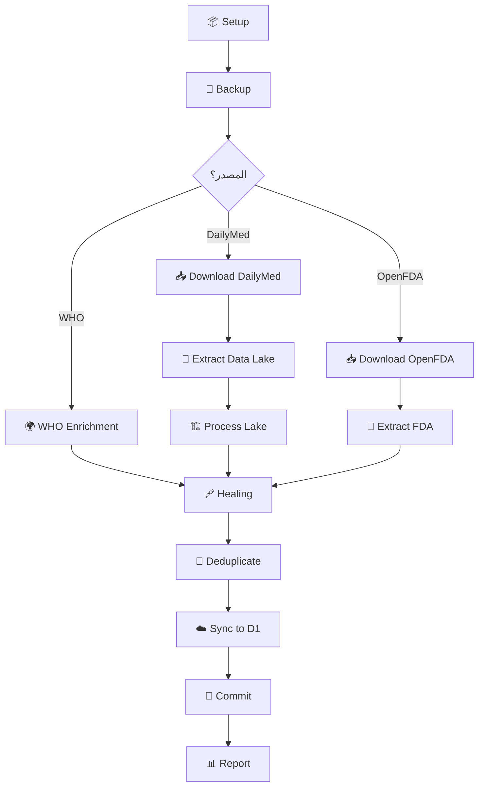

# 🚀 Advanced Dosage Data Enrichment Workflow

## نظرة عامة

Workflow خارق ومتطور لإثراء واستكمال بيانات الجرعات من **مصادر متعددة** مع معالجة ذكية وتنظيف تلقائي.

## 🎯 الأهداف

1. **جمع البيانات من 3 مصادر رئيسية:**
   - 🌍 WHO ATC/DDD Database (Excel - المصدر الأساسي)
   - 💊 DailyMed Full Release (الملاحظات السريرية التفصيلية)
   - 🔬 OpenFDA Drug Labels (بيانات تكميلية)

2. **معالجة ذكية:**
   - 🩹 استعادة النصوص المقطوعة (Healing)
   - 🧹 إزالة التكرار (Deduplication)
   - ✅ فحص الجودة التلقائي

3. **النشر الآلي:**
   - ☁️ رفع للـ Cloudflare D1
   - 📝 Commit تلقائي مع تقرير مفصل
   - 📊 تقرير نهائي شامل

## 📅 Schedule

- **أسبوعياً:** كل يوم أحد منتصف الليل UTC
- **يدوياً:** متاح عبر GitHub Actions UI

## 🎮 التشغيل اليدوي

### Via GitHub Actions:
1. اذهب إلى **Actions** → **Advanced Dosage Data Enrichment**
2. اضغط **Run workflow**
3. اختر الإعدادات:
   - `skip_download`: تخطي التحميل (استخدام الملفات الموجودة)
   - `full_rebuild`: إعادة بناء كاملة
   - `sources`: اختر المصادر (`all`, `dailymed`, `who`, `openfda`)

### Via Command Line:
```bash
# تشغيل كامل
gh workflow run advanced-dosage-enrichment.yml

# تخطي التحميل
gh workflow run advanced-dosage-enrichment.yml \
  -f skip_download=true

# معالجة WHO فقط
gh workflow run advanced-dosage-enrichment.yml \
  -f sources=who
```

## 🔄 خطوات العمل



## 📊 النتائج المتوقعة

| Metric | القيمة التقريبية |
|--------|------------------|
| WHO Entries | ~15,000 |
| DailyMed Entries | ~25,000 |
| OpenFDA Supplementary | ~5,000 |
| **المجموع** | **~45,000** |

## 🔐 المتطلبات

### GitHub Secrets:
- `CLOUDFLARE_ACCOUNT_ID`
- `D1_DATABASE_ID`
- `CLOUDFLARE_API_TOKEN`

### الملفات المطلوبة:
- ✅ `assets/external_research_data/WHO_ATC_DDD_2024.csv`
- ✅ `assets/meds.csv` (للمطابقة)
- ✅ `enrich_dosages_who.py`
- ✅ `scripts/heal_dosages.py`
- ✅ `scripts/process_datalake.py`

## 📝 مثال على التقرير النهائي

```
🚀 Dosage Data Enrichment Complete

📊 Statistics:
- Baseline: 25,327 records
- Final: 40,796 records
- Net Growth: +15,469

📈 Sources:
- WHO ATC/DDD: 15,690 records
- DailyMed: 24,106 records
- Still Truncated: 0 records

✅ Quality Assurance Complete
```

## 🎯 الميزات الخارقة

### 1. Multi-Source Intelligence
يجمع بذكاء من 3 مصادر مع منع التكرار وإعطاء الأولوية للبيانات الأدق.

### 2. Self-Healing
يستعيد تلقائياً النصوص المقطوعة من Data Lake.

### 3. Smart Deduplication
يحذف التكرار بناءً على `(med_id, source, instructions)`.

### 4. Quality Metrics
تقرير مفصل عن جودة البيانات بعد كل تشغيل.

### 5. Incremental Updates
يدعم التشغيل الجزئي (مصدر واحد فقط) لتوفير الوقت.

## 🔥 Best Practices

1. **أول تشغيل:** استخدم `sources=all` و `full_rebuild=true`
2. **تحديثات أسبوعية:** اترك الإعدادات الافتراضية
3. **إصلاح سريع:** استخدم `skip_download=true` مع معالجة محلية
4. **WHO فقط:** استخدم `sources=who` لتحديثات سريعة

## ⚠️ Troubleshooting

### Workflow timeout
- تقليل `sources` لمصدر واحد
- استخدام `skip_download=true`

### D1 upload fails
- تحقق من الـ API token
- راجع حدود الـ rate limiting

### No changes committed
- تحقق من وجود تعديلات فعلية
- راجع logs الـ deduplication

## 📚 Related Documentation

- [Dosage Tab Clinical Accuracy](file:///home/adminlotfy/.gemini/antigravity/brain/118eaf46-b396-4897-a36a-0a1bbb97d83f/walkthrough.md)
- [WHO Integration](file:///home/adminlotfy/project/enrich_dosages_who.py)
- [Healing Script](file:///home/adminlotfy/project/scripts/heal_dosages.py)

---

**Created:** 2026-01-04  
**Author:** Automated Setup  
**Status:** ✅ Ready for Production
