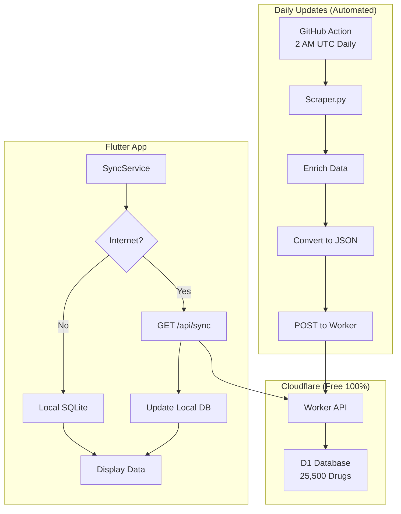

# 📚 دليل MediSwitch الشامل - من الصفر للنشر

## 🎯 نظرة عامة

هذا الدليل يغطي **كل شيء** من البداية للنهاية:
1. ✅ إعداد GitHub Actions للتحديث اليومي
2. ✅ نشر Cloudflare Worker + D1
3. ✅ تحديث قاعدة بيانات التطبيق
4. ✅ دفع الكود لجميع المستودعات

---

## 📋 الجزء الأول: إعداد GitHub Actions

### ✅ الخطوة 1: التحقق من الملفات الموجودة

تأكد من وجود هذه الملفات:
```
✓ scraper.py
✓ enrich_data.py  
✓ csv_to_json.py
✓ requirements.txt
✓ .github/workflows/daily-update.yml
```

### ✅ الخطوة 2: إعداد GitHub Secrets

اذهب إلى: **GitHub Repository → Settings → Secrets and variables → Actions**

أضف هذه Secrets:

| Key | Value | الوصف |
|-----|-------|-------|
| `DWAPRICES_PHONE` | `01558166440` | رقم الهاتف لموقع dwaprices |
| `DWAPRICES_TOKEN` | `bfwh2025-03-17` | Token للتسجيل |
| `WORKER_URL` | `https://mediswitch-api.YOUR-USERNAME.workers.dev` | URL الـ Worker (بعد النشر) |
| `WORKER_API_KEY` | `your-secure-api-key` | API Key للـ Worker (بعد الإعداد) |

### ✅ الخطوة 3: اختبار GitHub Action يدوياً

```
1. اذهب لـ GitHub → Actions
2. اختر "Daily Drug Price Update"
3. اضغط "Run workflow"
4. انتظر الإكمال (حوالي 15 دقيقة)
```

**ملاحظة:** سيفشل أول مرة لأن Worker لم يُنشر بعد - هذا طبيعي!

---

## 📋 الجزء الثاني: نشر Cloudflare Worker + D1

### ✅ الخطوة 1: إنشاء حساب Cloudflare

1. اذهب لـ [dash.cloudflare.com](https://dash.cloudflare.com/sign-up)
2. سجل حساب مجاني
3. فعّل الحساب عبر الإيميل

### ✅ الخطوة 2: تثبيت Wrangler CLI

```bash
npm install -g wrangler
```

**للتحقق:**
```bash
wrangler --version
```

### ✅ الخطوة 3: تسجيل الدخول

```bash
cd cloudflare-worker
wrangler login
```

سيفتح متصفح للمصادقة → اضغط "Allow"

### ✅ الخطوة 4: إنشاء D1 Database

```bash
wrangler d1 create mediswitch-db
```

**النتيجة:**
```
✅ Successfully created DB 'mediswitch-db'
binding = "DB"
database_name = "mediswitch-db"
database_id = "xxxx-xxxx-xxxx-xxxx"  ← انسخ هذا!
```

### ✅ الخطوة 5: تحديث wrangler.toml

افتح `cloudflare-worker/wrangler.toml` وضع `database_id`:

```toml
[[d1_databases]]
binding = "DB"
database_name = "mediswitch-db"
database_id = "PASTE-YOUR-DATABASE-ID-HERE"  ← هنا!
```

### ✅ الخطوة 6: تطبيق Schema على D1

```bash
wrangler d1 execute mediswitch-db --file=schema.sql
```

**النتيجة:**
```
🌀 Executing on mediswitch-db:
✅ Success!
```

### ✅ الخطوة 7: إعداد API Key

```bash
wrangler secret put API_KEY
```

أدخل API key قوي مثل: `mediswitch_2025_secure_key_xyz123`

**احفظ هذا Key** - ستحتاجه في GitHub Secrets!

### ✅ الخطوة 8: النشر

```bash
wrangler deploy
```

**النتيجة:**
```
✨ Successfully published your Worker!
🌍 https://mediswitch-api.YOUR-USERNAME.workers.dev
```

**انسخ الـ URL** ← ستحتاجه!

### ✅ الخطوة 9: اختبار Worker

```bash
curl "https://mediswitch-api.YOUR-USERNAME.workers.dev/api/stats"
```

**النتيجة المتوقعة:**
```json
{
  "total_drugs": 0,
  "total_companies": 0,
  "recent_updates_7d": 0
}
```

---

## 📋 الجزء الثالث: ربط GitHub Actions مع Worker

### ✅ الخطوة 1: تحديث GitHub Secrets

ارجع لـ GitHub Secrets وحدّث:

| Key | Value |
|-----|-------|
| `WORKER_URL` | `https://mediswitch-api.YOUR-USERNAME.workers.dev` |
| `WORKER_API_KEY` | `mediswitch_2025_secure_key_xyz123` |

### ✅ الخطوة 2: تشغيل GitHub Action مرة أخرى

```
GitHub → Actions → Daily Drug Price Update → Run workflow
```

**الآن يجب أن ينجح!** ✅

### ✅ الخطوة 3: التحقق من رفع البيانات

```bash
curl "https://mediswitch-api.YOUR-USERNAME.workers.dev/api/stats"
```

**يجب أن ترى:**
```json
{
  "total_drugs": 25500,
  "total_companies": 4649,
  "recent_updates_7d": 25500
}
```

---

## 📋 الجزء الرابع: تحديث قاعدة بيانات التطبيق

### ✅ الخطوة 1: التحقق من البيانات المُجلوبة

```bash
# تحقق من عدد الأسطر
wc -l meds_enriched.csv

# عرض أول 5 أسطر
head -5 meds_enriched.csv
```

### ✅ الخطوة 2: تحديث قاعدة البيانات الأساسية للتطبيق

**ملف قاعدة البيانات:** `assets/meds.csv`

```bash
# نسخ البيانات المحدثة لملف التطبيق
cp meds_enriched.csv assets/meds.csv

# التحقق
ls -lh assets/meds.csv
wc -l assets/meds.csv  # يجب أن يكون 25501 سطر (25500 + header)
```

**النتيجة:**
✅ ملف `assets/meds.csv` الآن محدث بـ **25,500 دواء كامل**

---

## 📋 الجزء الخامس: تحديث Flutter App

### ✅ الخطوة 1: تحديث BASE_URL

افتح `lib/services/sync_service.dart`:

```dart
static const String BASE_URL = 'https://mediswitch-api.YOUR-USERNAME.workers.dev';
```

ضع Worker URL الحقيقي!

### ✅ الخطوة 2: اختبار المزامنة

```dart
// في main.dart أو أي screen
final syncService = SyncService();
final result = await syncService.sync();
print(result); // يجب أن يعرض عدد الأدوية المزامنة
```

---

## 📋 الجزء السادس: دفع الكود لجميع المستودعات

### ✅ الخطوة 1: التحقق من المستودعات المرتبطة

```bash
git remote -v
```

### ✅ الخطوة 2: إضافة جميع الملفات

```bash
# إضافة جميع التغييرات
git add .

# عرض الملفات المتغيرة
git status
```

### ✅ الخطوة 3: Commit

```bash
git commit -m "Complete Cloudflare Workers integration with auto-sync

- Added Cloudflare Worker API with D1 Database
- Implemented GitHub Actions daily scraper
- Added Flutter SyncService for automatic sync
- Updated localization files (fixed priceLabel)
- Added comprehensive deployment guides
- Enriched 25,500 drugs with full data (20 columns)

Ready for production deployment!"
```

### ✅ الخطوة 4: دفع لجميع المستودعات

```bash
# إذا كان عندك remote واحد
git push origin main

# إذا كان عندك عدة remotes
git remote | xargs -I {} git push {} main

# أو يدوياً لكل واحد
git push origin main
git push backup main
git push production main
```

**لإضافة remote جديد:**
```bash
git remote add backup https://github.com/YOUR-USERNAME/MediSwitch-Backup.git
git push backup main
```

---

## 🧪 الجزء السابع: الاختبار النهائي

### ✅ 1. اختبار Cloudflare Worker

```bash
# Stats
curl "https://YOUR-WORKER-URL/api/stats"

# Sync (آخر 7 أيام)
curl "https://YOUR-WORKER-URL/api/sync?since=2025-11-25"

# عدد الأدوية
curl "https://YOUR-WORKER-URL/api/drugs?limit=1" | jq '.pagination.total'
```

### ✅ 2. اختبار GitHub Action

- ✅ يعمل يومياً الساعة 2 صباحاً UTC
- ✅ يجلب البيانات الجديدة
- ✅ يرفعها للـ Worker
- ✅ يحدث الإحصائيات

### ✅ 3. اختبار Flutter App

- ✅ المزامنة تعمل عند فتح التطبيق
- ✅ Offline mode يعمل
- ✅ البيانات محدثة

---

## 📊 ملخص النظام النهائي



---

## ✅ Checklist النهائي

### إعداد أولي
- [ ] تثبيت Wrangler CLI
- [ ] تسجيل دخول Cloudflare
- [ ] إنشاء D1 Database
- [ ] تطبيق Schema
- [ ] إعداد API Key

### النشر
- [ ] نشر Worker
- [ ] اختبار Worker
- [ ] إضافة GitHub Secrets
- [ ] تشغيل GitHub Action
- [ ] التحقق من رفع البيانات

### التطبيق
- [ ] تحديث BASE_URL في Flutter
- [ ] تحديث قاعدة البيانات المحلية
- [ ] اختبار المزامنة
- [ ] Build للإنتاج

### Git
- [ ] Commit جميع التغييرات
- [ ] دفع لجميع المستودعات
- [ ] التأكد من Sync النجاح

---

## 🆘 استكشاف الأخطاء

### مشكلة: "Database not found"
```bash
wrangler d1 list  # تحقق من الـ databases
```

### مشكلة: "Unauthorized" في Worker
```bash
wrangler secret list  # تحقق من API_KEY
```

### مشكلة: GitHub Action يفشل
- تحقق من GitHub Secrets
- تحقق من logs في Actions → Build

### مشكلة: Flutter لا يزامن
- تحقق من BASE_URL
- تحقق من Internet connection
- افحص console logs

---

## 📞 روابط مفيدة

- **Cloudflare Dashboard:** https://dash.cloudflare.com
- **Worker Logs:** Dashboard → Workers → mediswitch-api → Logs
- **D1 Console:** Dashboard → D1 → mediswitch-db
- **GitHub Actions:** Repository → Actions

---

## 💰 التكلفة النهائية

| الخدمة | التكلفة |
|--------|---------|
| Cloudflare Workers | **مجاني** |
| D1 Database | **مجاني** |
| GitHub Actions | **مجاني** |
| **المجموع** | **0 ج.م / شهر** 🎉 |

---

**تم! 🎊**

نظامك الآن:
- ✅ يحدث البيانات تلقائياً يومياً
- ✅ يعمل مجاناً 100%
- ✅ سريع جداً (Edge Computing)
- ✅ مزامنة ذكية في التطبيق
- ✅ جاهز للإنتاج

**أي سؤال؟ اسأل! 😊**
