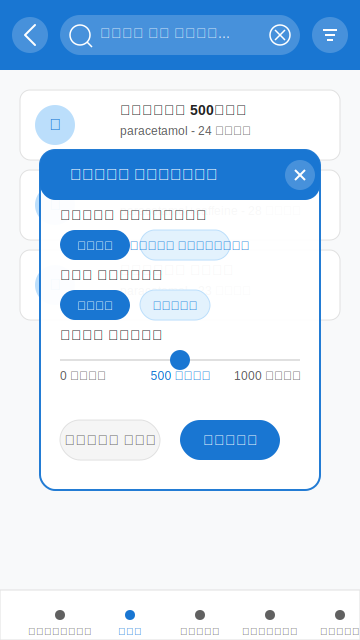
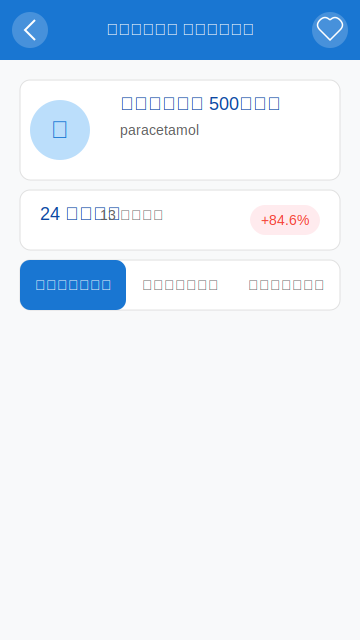
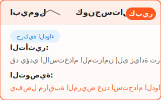
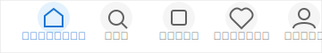

# توثيق مفصل لواجهة المستخدم

## نظرة عامة

تم تصميم واجهة المستخدم لتطبيق MediSwitch بأسلوب عصري وسهل الاستخدام، مع التركيز على تجربة مستخدم سلسة باللغة العربية. يهدف التصميم إلى تقديم معلومات الأدوية بطريقة منظمة وجذابة، مع توفير أدوات مساعدة مثل البحث والتصفية والمقارنة بين الأدوية.

## الألوان والخطوط

### نظام الألوان

```css
:root {
    /* الألوان الأساسية */
    --primary-color: #1976D2; /* أزرق طبي */
    --primary-light: #BBDEFB;
    --primary-dark: #0D47A1;
    --secondary-color: #f8f9fa; /* رمادي فاتح */
    --accent-color: #FF5722; /* برتقالي */
    --accent-light: #FFCCBC; /* برتقالي فاتح */
    --text-color: #212121;
    --text-light: #616161;
    --background-color: #ffffff;
    --card-color: #ffffff;
    --border-color: #e0e0e0;
    --success-color: #4CAF50;
    --success-light: #E8F5E9;
    --warning-color: #ff9800;
    --warning-light: #FFF3E0;
    --error-color: #f44336;
    --error-light: #FFEBEE;
}
```

### الخطوط

- **الخط الرئيسي**: Noto Sans Arabic
- **الأوزان المستخدمة**: 300 (خفيف)، 400 (عادي)، 500 (متوسط)، 600 (شبه ثقيل)، 700 (ثقيل)
- **حجم الخط الافتراضي**: 16px

### التباعدات والزوايا

```css
:root {
    /* المسافات */
    --spacing-xs: 4px;
    --spacing-sm: 8px;
    --spacing-md: 16px;
    --spacing-lg: 24px;
    --spacing-xl: 32px;
    
    /* الزوايا */
    --border-radius-sm: 6px;
    --border-radius-md: 12px;
    --border-radius-lg: 18px;
    --border-radius-xl: 24px;
    --border-radius-full: 9999px;
}
```

## الشاشات الرئيسية

### 1. الشاشة الرئيسية (Home Screen)


#### المكونات الرئيسية

1. **رأس الصفحة (Header)**
   - معلومات المستخدم وصورته الشخصية
   - شريط البحث السريع

2. **قسم الفئات (Categories)**
   - عرض شبكي للفئات الرئيسية للأدوية
   - كل فئة تحتوي على أيقونة ونص توضيحي

3. **الأدوية المحدثة مؤخراً**
   - قائمة أفقية قابلة للتمرير
   - عرض الأدوية التي تم تحديث أسعارها مؤخراً

4. **الأدوية الأكثر بحثاً**
   - قائمة أفقية قابلة للتمرير
   - عرض الأدوية الأكثر شيوعاً في عمليات البحث

#### التنفيذ البرمجي

```html
<div class="screen active" id="home-screen">
    <div class="header">
        <div class="user-profile">
            <div class="user-greeting">
                <h2>مرحباً، أحمد</h2>
                <p>كيف حالك اليوم؟</p>
            </div>
            <div class="user-avatar">
                
            </div>
        </div>
        <div class="search-bar">
            <i class="fas fa-search"></i>
            <input type="text" placeholder="ابحث عن دواء..." id="search-input">
        </div>
    </div>
    
    <div class="categories-section">
        <h3>الفئات</h3>
        <div class="categories-grid">
            <!-- بطاقات الفئات -->
        </div>
    </div>
    
    <div class="recent-drugs-section">
        <div class="section-header">
            <h3>أدوية محدثة مؤخراً</h3>
            <a href="#" class="view-all">عرض الكل</a>
        </div>
        <div class="drugs-horizontal-list" id="recent-drugs-list">
            <!-- قائمة الأدوية المحدثة -->
        </div>
    </div>
    
    <div class="popular-drugs-section">
        <div class="section-header">
            <h3>الأدوية الأكثر بحثاً</h3>
            <a href="#" class="view-all">عرض الكل</a>
        </div>
        <div class="drugs-horizontal-list" id="popular-drugs-list">
            <!-- قائمة الأدوية الشائعة -->
        </div>
    </div>
</div>
```

### 2. شاشة البحث (Search Screen)



#### المكونات الرئيسية

1. **شريط التطبيق (App Bar)**
   - زر الرجوع
   - حقل البحث النشط
   - زر الفلترة

2. **نتائج البحث**
   - قائمة عمودية لنتائج البحث
   - كل نتيجة تعرض معلومات أساسية عن الدواء

3. **نافذة الفلترة (Filter Modal)**
   - خيارات تصفية النتائج حسب الفئة وشكل الدواء والسعر
   - أزرار إعادة الضبط وتطبيق الفلترة

#### التنفيذ البرمجي

```html
<div class="screen" id="search-screen">
    <div class="app-bar">
        <div class="back-button">
            <i class="fas fa-arrow-right"></i>
        </div>
        <div class="search-input-container">
            <i class="fas fa-search"></i>
            <input type="text" placeholder="ابحث عن دواء..." id="active-search-input">
            <i class="fas fa-times" id="clear-search"></i>
        </div>
        <div class="filter-button">
            <i class="fas fa-filter"></i>
        </div>
    </div>
    
    <div class="search-results" id="search-results">
        <!-- نتائج البحث -->
    </div>
    
    <!-- نافذة الفلترة -->
    <div class="filter-modal" id="filter-modal">
        <div class="filter-content">
            <div class="filter-header">
                <h3>تصفية النتائج</h3>
                <button class="close-filter">
                    <i class="fas fa-times"></i>
                </button>
            </div>
            <div class="filter-body">
                <!-- محتوى الفلترة -->
            </div>
            <div class="filter-footer">
                <button class="reset-filter">إعادة ضبط</button>
                <button class="apply-filter">تطبيق</button>
            </div>
        </div>
    </div>
</div>
```

### 3. شاشة تفاصيل الدواء (Drug Details Screen)



#### المكونات الرئيسية

1. **شريط التطبيق (App Bar)**
   - زر الرجوع
   - عنوان الشاشة
   - زر الإضافة للمفضلة

2. **معلومات الدواء الأساسية**
   - اسم الدواء والمادة الفعالة
   - السعر الحالي والسعر القديم ونسبة التغيير

3. **علامات التبويب (Tabs)**
   - معلومات: تفاصيل عامة عن الدواء
   - البدائل: قائمة بالأدوية البديلة
   - الجرعات: معلومات عن الجرعات الموصى بها

4. **قسم التفاعلات الدوائية**
   - عرض التفاعلات المحتملة مع أدوية أخرى
   - زر لفحص التفاعلات مع أدوية محددة

#### التنفيذ البرمجي

```html
<div class="screen" id="drug-details-screen">
    <div class="app-bar">
        <div class="back-button">
            <i class="fas fa-arrow-right"></i>
        </div>
        <h2>تفاصيل الدواء</h2>
        <div class="favorite-button">
            <i class="far fa-heart"></i>
        </div>
    </div>
    
    <div class="drug-details-content">
        <div class="drug-header">
            <div class="drug-image">
                <i class="fas fa-pills"></i>
            </div>
            <div class="drug-title">
                <h3 id="drug-name"></h3>
                <p id="drug-active"></p>
            </div>
        </div>
        
        <div class="drug-price-section">
            <!-- معلومات السعر -->
        </div>
        
        <div class="drug-info-tabs">
            <div class="tab-buttons">
                <button class="tab-button active" data-tab="info">معلومات</button>
                <button class="tab-button" data-tab="alternatives">البدائل</button>
                <button class="tab-button" data-tab="dosage">الجرعات</button>
            </div>
            
            <div class="tab-content active" id="info-tab">
                <!-- محتوى تبويب المعلومات -->
            </div>
            
            <div class="tab-content" id="alternatives-tab">
                <!-- محتوى تبويب البدائل -->
            </div>
            
            <div class="tab-content" id="dosage-tab">
                <!-- محتوى تبويب الجرعات -->
            </div>
        </div>
        
        <div class="drug-interactions-section">
            <h3>التفاعلات الدوائية المحتملة</h3>
            <div id="interactions-list">
                <!-- قائمة التفاعلات -->
            </div>
            <button class="check-interactions-button">
                <i class="fas fa-exchange-alt"></i>
                فحص التفاعلات مع أدوية أخرى
            </button>
        </div>
    </div>
</div>
```

### 4. شاشة فحص التفاعلات الدوائية (Drug Interactions Screen)



#### المكونات الرئيسية

1. **شريط التطبيق (App Bar)**
   - زر الرجوع
   - عنوان الشاشة

2. **قسم اختيار الأدوية**
   - قائمة الأدوية المختارة
   - زر إضافة دواء جديد

3. **نتائج التفاعلات**
   - قائمة التفاعلات المكتشفة
   - تصنيف التفاعلات حسب الشدة
   - تفاصيل كل تفاعل والتوصيات

#### التنفيذ البرمجي

```html
<div class="screen" id="drug-interactions-screen">
    <div class="app-bar">
        <div class="back-button">
            <i class="fas fa-arrow-right"></i>
        </div>
        <h2>فحص التفاعلات الدوائية</h2>
    </div>
    
    <div class="interactions-content">
        <div class="selected-drugs-section">
            <h3>الأدوية المختارة</h3>
            <div class="selected-drugs-list" id="selected-drugs-list">
                <!-- قائمة الأدوية المختارة -->
            </div>
            <button class="add-drug-button">
                <i class="fas fa-plus"></i>
                إضافة دواء
            </button>
        </div>
        
        <div class="interactions-results-section">
            <h3>نتائج التفاعلات</h3>
            <div class="interactions-summary">
                <div class="severity-indicator severe">
                    <span class="count">0</span>
                    <span class="label">شديد</span>
                </div>
                <div class="severity-indicator major">
                    <span class="count">0</span>
                    <span class="label">كبير</span>
                </div>
                <div class="severity-indicator moderate">
                    <span class="count">0</span>
                    <span class="label">متوسط</span>
                </div>
                <div class="severity-indicator minor">
                    <span class="count">0</span>
                    <span class="label">بسيط</span>
                </div>
            </div>
            <div class="interactions-list" id="interactions-results-list">
                <!-- قائمة نتائج التفاعلات -->
            </div>
        </div>
    </div>
</div>
```

## مكونات واجهة المستخدم

### 1. بطاقة الدواء (Drug Card)



```html
<div class="drug-card" data-id="1">
    <div class="drug-icon">
        <i class="fas fa-pills"></i>
    </div>
    <div class="drug-name">ابيمول 500مجم</div>
    <div class="drug-active">paracetamol</div>
    <div class="drug-price">
        24 <span class="currency">جنيه</span>
    </div>
</div>
```

### 2. بطاقة التفاعل الدوائي (Interaction Card)



```html
<div class="interaction-card" data-severity="major">
    <div class="interaction-header">
        <div class="drug-pair">
            <span class="drug1">ابيمول</span>
            <i class="fas fa-exchange-alt"></i>
            <span class="drug2">كونجستال</span>
        </div>
        <div class="severity-badge major">كبير</div>
    </div>
    <div class="interaction-type-badge">حركية الدواء</div>
    <div class="interaction-effect">
        قد يؤدي الاستخدام المتزامن إلى زيادة تركيز الباراسيتامول في الدم.
    </div>
    <div class="interaction-recommendation">
        يفضل مراقبة المريض عند استخدام الدوائين معًا وتعديل الجرعة إذا لزم الأمر.
    </div>
</div>
```

### 3. شريط التنقل السفلي (Bottom Navigation)



```html
<div class="bottom-nav">
    <div class="nav-item active" data-screen="home-screen">
        <i class="fas fa-home"></i>
        <span>الرئيسية</span>
    </div>
    <div class="nav-item" data-screen="search-screen">
        <i class="fas fa-search"></i>
        <span>بحث</span>
    </div>
    <div class="nav-item" data-screen="dose-calculator-screen">
        <i class="fas fa-calculator"></i>
        <span>حاسبة الجرعات</span>
    </div>
    <div class="nav-item" data-screen="favorites-screen">
        <i class="fas fa-heart"></i>
        <span>المفضلة</span>
    </div>
    <div class="nav-item" data-screen="profile-screen">
        <i class="fas fa-user"></i>
        <span>حسابي</span>
    </div>
</div>
```

## التفاعلات والسلوكيات

### 1. البحث والتصفية

```javascript
// مستمعي أحداث البحث
function setupSearchListeners() {
    // البحث من الشاشة الرئيسية
    const searchInput = document.getElementById('search-input');
    searchInput.addEventListener('focus', function() {
        // الانتقال إلى شاشة البحث
        showScreen('search-screen');
        // نقل التركيز إلى حقل البحث النشط
        document.getElementById('active-search-input').focus();
    });
    
    // البحث النشط
    const activeSearchInput = document.getElementById('active-search-input');
    activeSearchInput.addEventListener('input', function() {
        // تنفيذ البحث في الوقت الفعلي
        performSearch(this.value);
    });
    
    // مسح البحث
    const clearSearchButton = document.getElementById('clear-search');
    clearSearchButton.addEventListener('click', function() {
        activeSearchInput.value = '';
        performSearch('');
    });
    
    // فتح نافذة الفلترة
    const filterButton = document.querySelector('.filter-button');
    filterButton.addEventListener('click', function() {
        document.getElementById('filter-modal').classList.add('active');
    });
    
    // إغلاق نافذة الفلترة
    const closeFilterButton = document.querySelector('.close-filter');
    closeFilterButton.addEventListener('click', function() {
        document.getElementById('filter-modal').classList.remove('active');
    });
    
    // تطبيق الفلترة
    const applyFilterButton = document.querySelector('.apply-filter');
    applyFilterButton.addEventListener('click', function() {
        // جمع معايير الفلترة
        const selectedCategory = document.querySelector('#main-category-chips .filter-chip.active').dataset.category;
        const selectedForm = document.querySelector('#dosage-form-chips .filter-chip.active').dataset.form;
        const maxPrice = document.getElementById('price-slider').value;
        
        // تطبيق الفلترة
        applyFilters(selectedCategory, selectedForm, maxPrice);
        
        // إغلاق نافذة الفلترة
        document.getElementById('filter-modal').classList.remove('active');
    });
}
```

### 2. عرض تفاصيل الدواء

```javascript
// عرض تفاصيل الدواء
function showDrugDetails(drugId) {
    // البحث عن الدواء في قاعدة البيانات
    const drug = medicinesData.find(d => d.id === drugId);
    if (!drug) return;
    
    // تعبئة بيانات الدواء في الواجهة
    document.getElementById('drug-name').textContent = drug.arabic_name;
    document.getElementById('drug-active').textContent = drug.active;
    document.getElementById('drug-price').textContent = drug.price;
    document.getElementById('drug-old-price').textContent = drug.old_price;
    
    // حساب نسبة التغيير في السعر
    const priceChange = ((drug.price - drug.old_price) / drug.old_price) * 100;
    document.getElementById('price-change-percentage').textContent = 
        `${priceChange > 0 ? '+' : ''}${priceChange.toFixed(1)}%`;
    document.getElementById('price-change-percentage').className = 
        priceChange > 0 ? 'price-increase' : 'price-decrease';
    
    // تعبئة معلومات الدواء
    document.getElementById('drug-company').textContent = drug.company;
    document.getElementById('drug-category').textContent = drug.category_ar;
    document.getElementById('drug-form').textContent = drug.dosage_form_ar;
    document.getElementById('drug-description').textContent = drug.description;
    
    // البحث عن البدائل
    findAlternatives(drug);
    
    // البحث عن معلومات الجرعات
    findDosageInfo(drug);
    
    // البحث عن التفاعلات الدوائية
    findDrugInteractions(drug);
    
    // عرض شاشة تفاصيل الدواء
    showScreen('drug-details-screen');
}
```

### 3. التنقل بين علامات التبويب

```javascript
// مستمعي أحداث علامات التبويب
function setupTabsListeners() {
    const tabButtons = document.querySelectorAll('.tab-button');
    const tabContents = document.querySelectorAll('.tab-content');
    
    tabButtons.forEach(button => {
        button.addEventListener('click', function() {
            // إزالة الفئة النشطة من جميع الأزرار
            tabButtons.forEach(btn => btn.classList.remove('active'));
            // إضافة الفئة النشطة للزر الحالي
            this.classList.add('active');
            
            // إخفاء جميع محتويات التبويب
            tabContents.forEach(content => content.classList.remove('active'));
            // عرض محتوى التبويب المطلوب
            const tabId = this.dataset.tab;
            document.getElementById(`${tabId}-tab`).classList.add('active');
        });
    });
}
```

## تحسينات مقترحة للتنفيذ

### 1. تحسينات تجربة المستخدم

- **وضع الليل (Dark Mode)**: إضافة دعم لوضع الليل لتقليل إجهاد العين وتوفير الطاقة.
- **تخصيص الواجهة**: السماح للمستخدم بتخصيص ترتيب العناصر والألوان حسب تفضيلاته.
- **دعم الإشعارات**: إضافة نظام إشعارات لتنبيه المستخدم بتحديثات الأسعار أو معلومات جديدة.
- **تحسين الوصول**: تحسين إمكانية الوصول للأشخاص ذوي الاحتياجات الخاصة.

### 2. تحسينات تقنية

- **تحسين الأداء**: تحسين سرعة تحميل الصفحات وتقليل استهلاك الموارد.
- **التخزين المؤقت**: تخزين البيانات المستخدمة بشكل متكرر لتقليل الاتصالات بالخادم.
- **دعم وضع عدم الاتصال**: تمكين التطبيق من العمل بدون اتصال بالإنترنت.
- **اختبارات الواجهة**: إضافة اختبارات شاملة لضمان توافق الواجهة مع مختلف الأجهزة والمتصفحات.

### 3. ميزات جديدة مقترحة

- **مقارنة الأدوية**: إضافة أداة لمقارنة خصائص وأسعار الأدوية جنباً إلى جنب.
- **تذكيرات الدواء**: إضافة نظام تذكير لمواعيد تناول الأدوية.
- **تتبع المخزون**: إضافة ميزة لتتبع مخزون الأدوية المنزلي.
- **تكامل الخرائط**: إضافة خريطة تفاعلية للعثور على أقرب صيدلية.
- **مشاركة المعلومات**: إضافة خيارات لمشاركة معلومات الدواء مع الآخرين.

## إرشادات للمطورين

### 1. هيكل الملفات

```
ui_prototype/
├── css/
│   └── styles.css       # أنماط CSS الرئيسية
├── js/
│   ├── app.js           # منطق التطبيق الرئيسي
│   └── data.js          # بيانات الأدوية
├── img/                 # الصور والأيقونات
└── index.html          # هيكل HTML الرئيسي
```

### 2. أفضل الممارسات

- **التصميم المتجاوب**: تأكد من أن التطبيق يعمل بشكل جيد على جميع أحجام الشاشات.
- **الأداء**: تحسين الأداء عن طريق تقليل عدد طلبات HTTP وضغط الملفات.
- **التوافق**: اختبار التطبيق على مختلف المتصفحات والأجهزة.
- **الأمان**: اتباع أفضل ممارسات الأمان في معالجة بيانات المستخدم.
- **التوثيق**: توثيق الكود بشكل جيد لتسهيل الصيانة والتطوير المستقبلي.

### 3. التكامل مع الوحدات الأخرى

- **تكامل حاسبة الجرعات**: ربط واجهة المستخدم مع وحدة حاسبة الجرعات لعرض معلومات الجرعات في صفحة تفاصيل الدواء.
- **تكامل خوارزمية التفاعلات**: ربط واجهة المستخدم مع خوارزمية تفاعلات الأدوية لعرض التفاعلات المحتملة.
- **تكامل قاعدة البيانات**: ربط واجهة المستخدم مع قاعدة بيانات الأدوية الرئيسية للحصول على بيانات حديثة ودقيقة.

## المصادر والمراجع

1. Material Design Guidelines - https://material.io/design
2. Web Content Accessibility Guidelines (WCAG) - https://www.w3.org/WAI/standards-guidelines/wcag/
3. Flutter UI Design Patterns - https://flutter.dev/docs/development/ui/widgets
4. Mobile UI/UX Design Trends - https://www.smashingmagazine.com/category/mobile
5. Arabic UI Design Best Practices - https://www.arabicux.com
6. Font Awesome Icons Library - https://fontawesome.com/
7. Google Fonts (Noto Sans Arabic) - https://fonts.google.com/specimen/Noto+Sans+Arabic
8. CSS Flexbox Layout - https://css-tricks.com/snippets/css/a-guide-to-flexbox/
9. CSS Grid Layout - https://css-tricks.com/snippets/css/complete-guide-grid/