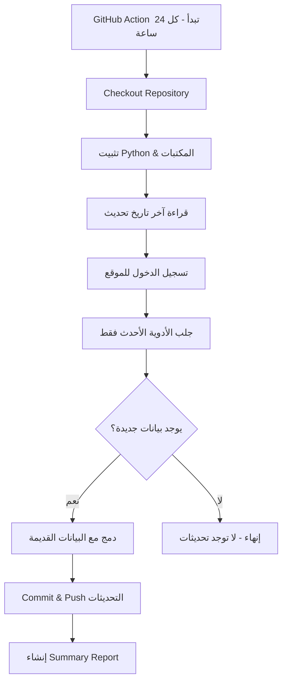

# GitHub Actions - Daily Drug Price Updater

## 📖 نظرة عامة
نظام تلقائي يعمل على GitHub Actions لجلب تحديثات أسعار الأدوية الجديدة يومياً وحفظها في repository.

## 🎯 كيف يعمل؟

### 1. الجدولة التلقائية
- يعمل **كل يوم** الساعة 2:00 صباحاً UTC (4:00 صباحاً القاهرة)
- يمكن تشغيله يدوياً من تبويب "Actions" في GitHub

### 2. التحديث التدريجي (Incremental Update)
- يقرأ آخر تاريخ تحديث من ملف `meds_updated.csv`
- يجلب **فقط** الأدوية الأحدث من هذا التاريخ
- يدمج البيانات الجديدة مع القديمة (يحدث أو يضيف)
- يحفظ التغييرات تلقائياً في الـ repository

### 3. الملفات المستخدمة
- `scraper_incremental.py` - سكريبت جلب البيانات الجديدة فقط
- `.github/workflows/daily-update.yml` - GitHub Action workflow
- `meds_updated.csv` - قاعدة البيانات الرئيسية (يتم تحديثها تلقائياً)

## 🚀 خطوات الإعداد

### الخطوة 1: إنشاء Repository في GitHub
```bash
cd /home/adminlotfy/project
git init
git add .
git commit -m "Initial commit"
git remote add origin https://github.com/YOUR_USERNAME/mediswitch-scraper.git
git push -u origin main
```

### الخطوة 2: إضافة Secrets
اذهب إلى: `Settings` → `Secrets and variables` → `Actions` → `New repository secret`

أضف:
- **Name:** `DWAPRICES_PHONE`
  **Value:** `01558166440`

- **Name:** `DWAPRICES_TOKEN`
  **Value:** `bfwh2025-03-17`

### الخطوة 3: تفعيل GitHub Actions
1. اذهب لتبويب `Actions` في repository
2. إذا طُلب منك، اضغط "I understand my workflows, go ahead and enable them"
3. انتظر أول تشغيل تلقائي (الساعة 2 صباحاً UTC) أو شغّله يدوياً

## 🔄 سير العمل (Workflow)



## 📊 مثال على التشغيل

### السيناريو:
- آخر تحديث: **01/12/2025**
- الأدوية الموجودة: **25,000 دواء**

### التشغيل في 02/12/2025:
```
[02:00] ✓ Logged in as: محمود لطفي
[02:00] Total drugs in database: 25453
[02:00] Fetching drugs updated after: 01/12/2025
[02:00] Batch 1: Found 38 new drugs
[02:01] Batch 2: Found 0 new drugs (Total: 38)
[02:01] ✓ Reached cutoff date, stopping.
[02:01] ✓ Saved 38 drugs to new_drugs.csv
[02:01] Total drugs after merge: 25038
[02:01] New/Updated drugs: 38
[02:01] ✓ Commit: "Update drug prices - 2025-12-02 02:01:15"
```

## 📁 هيكل الملفات في الـ Repository

```
mediswitch-scraper/
├── .github/
│   └── workflows/
│       └── daily-update.yml     # GitHub Action workflow
├── scraper.py                   # السكريبت الأصلي (جلب كل البيانات)
├── scraper_incremental.py       # سكريبت التحديث التدريجي
├── requirements.txt             # المكتبات المطلوبة
├── meds_updated.csv            # قاعدة البيانات (يتحدث تلقائياً)
└── README.md                    # هذا الملف
```

## 🔍 مراقبة التشغيل

### عرض السجلات (Logs)
1. اذهب لتبويب `Actions`
2. اختر آخر workflow run
3. اضغط على `scrape-and-update` لعرض التفاصيل

### قراءة الملخص (Summary)
كل run يُنشئ ملخص تلقائي يحتوي على:
- ⏰ وقت التشغيل
- 📅 آخر تاريخ تحديث
- 🆕 عدد الأدوية الجديدة/المحدثة
- ✅ حالة التشغيل

## ⚙️ تخصيص إعدادات الجدولة

لتغيير وقت التشغيل، عدّل ملف `.github/workflows/daily-update.yml`:

```yaml
on:
  schedule:
    # كل يوم الساعة 6 مساءً GMT (8 مساءً القاهرة)
    - cron: '0 18 * * *'
    
    # كل 12 ساعة
    - cron: '0 */12 * * *'
    
    # كل يوم أحد الساعة 12 ظهراً
    - cron: '0 12 * * 0'
```

[مساعد Cron Expression](https://crontab.guru/)

## 🛠️ استكشاف الأخطاء

### "No new data found"
✅ طبيعي - لا توجد أدوية محدثة منذ آخر تشغيل

### "Login failed"
✅ تأكد من Secrets في GitHub (DWAPRICES_PHONE, DWAPRICES_TOKEN)

### "Permission denied" عند الـ Push
✅ تأكد من تفعيل Write permissions:
`Settings` → `Actions` → `General` → `Workflow permissions` → اختر "Read and write"

## 💡 نصائح

1. **Backup يدوي:** احفظ نسخة من `meds_updated.csv` خارج GitHub بشكل دوري
2. **مراقبة الحجم:** إذا كبر حجم الـ CSV، استخدم Git LFS
3. **Notifications:** فعّل إشعارات GitHub لتصلك عند فشل Action

## 🔗 روابط مفيدة
- [GitHub Actions Documentation](https://docs.github.com/en/actions)
- [Cron Expression Editor](https://crontab.guru/)
- [GitHub Secrets Guide](https://docs.github.com/en/actions/security-guides/encrypted-secrets)

---

**تم الإعداد في:** 02/12/2025
**الإصدار:** 1.0
