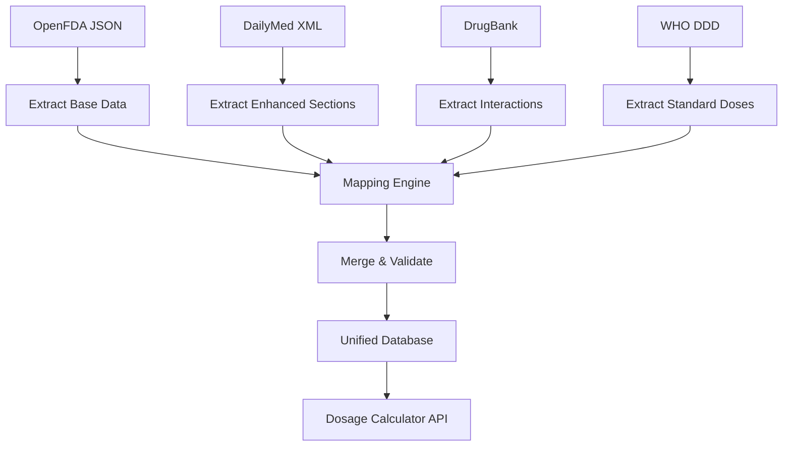

# خطة تنفيذ استخراج البيانات المحسّنة
## Enhanced Data Extraction Implementation Plan

---

## 🎯 الهدف

إنشاء قاعدة بيانات شاملة لحاسبة الجرعات من **مصادر مجانية** بتغطية 85-95%

---

## 📋 المراحل التنفيذية

### المرحلة 1: استخراج محسّن من DailyMed ⭐ (الأولوية)

#### السكربت المطلوب: `extract_dailymed_enhanced.py`

**الأقسام المستهدفة بالـ LOINC codes:**

```python
TARGET_SECTIONS = {
    '34068-7': 'DOSAGE_AND_ADMINISTRATION',
    '34081-0': 'PEDIATRIC_USE',            # ⭐ Critical
    '34082-8': 'GERIATRIC_USE',            # ⭐ High priority
    '34073-7': 'DRUG_INTERACTIONS',
    '43682-4': 'USE_IN_SPECIFIC_POPULATIONS_RENAL',  # ⭐ Critical
    '43683-2': 'USE_IN_SPECIFIC_POPULATIONS_HEPATIC', # ⭐ Critical
    '34070-3': 'CONTRAINDICATIONS',
    '34071-1': 'WARNINGS',
    '43685-7': 'WARNINGS_AND_PRECAUTIONS',
}
```

**البيانات المطلوب استخراجها:**

```python
EXTRACTION_PATTERNS = {
    # Pediatric dosing
    'pediatric_mg_kg': r'(\d+(?:\.\d+)?)\s*mg/kg',
    'pediatric_age_min': r'(?:children|pediatric).*?(?:≥|>=|above|older than)\s*(\d+)\s*(month|year)',
    'pediatric_age_max': r'(?:children|pediatric).*?(?:≤|<=|below|under|up to)\s*(\d+)\s*(year)',
    
    # Max doses
    'max_single_dose': r'(?:maximum|max).*?(?:single|dose).*?(\d+)\s*(mg|mcg|g)',
    'max_daily_dose': r'(?:maximum|max).*?(?:daily|per day).*?(\d+)\s*(mg|mcg|g)',
    
    # Frequency
    'frequency_hours': r'every\s*(\d+)\s*(?:hour|hr)',
    'frequency_times': r'(\d+)\s*times?\s*(?:daily|per day|a day)',
    
    # Renal adjustment
    'renal_crcl_threshold': r'(?:CrCl|creatinine clearance).*?(<|≤)\s*(\d+)',
    'renal_dose_reduction': r'(?:reduce|decrease).*?(?:dose|dosage).*?(\d+)%',
    
    # Hepatic adjustment
    'hepatic_child_pugh': r'Child-Pugh\s*(A|B|C)',
    'hepatic_contraindicated': r'(?:contraindicated|avoid).*?(?:hepatic|liver)',
}
```

---

### المرحلة 2: Mapping بين OpenFDA و DailyMed

#### السكربت: `map_openfda_dailymed.py`

**استراتيجية المطابقة:**

```python
def match_drugs(openfda_record, dailymed_records):
    """
    Match OpenFDA drug with DailyMed using:
    1. NDC codes (exact match) - Priority 1
    2. Active ingredient + strength - Priority 2
    3. Brand name - Priority 3
    """
    
    # Method 1: NDC exact match
    openfda_ndcs = extract_ndcs(openfda_record)
    for dm_record in dailymed_records:
        dm_ndcs = extract_ndcs(dm_record)
        if set(openfda_ndcs) & set(dm_ndcs):  # Intersection
            return dm_record, 'ndc_match'
    
    # Method 2: Ingredient + Strength
    openfda_key = (
        openfda_record['active_ingredient'].lower(),
        normalize_strength(openfda_record['strength'])
    )
    
    for dm_record in dailymed_records:
        dm_key = (
            dm_record['active_ingredient'].lower(),
            normalize_strength(dm_record['strength'])
        )
        if openfda_key == dm_key:
            return dm_record, 'ingredient_match'
    
    return None, 'no_match'
```

---

### المرحلة 3: إثراء البيانات من DrugBank

#### API/Dataset: DrugBank Open Data

```python
# DrugBank focus: Drug Interactions enhancement
DRUGBANK_FIELDS = [
    'drug_interactions',      # More detailed than OpenFDA
    'mechanism',              # Interaction mechanism
    'severity',               # Contraindicated/Major/Moderate/Minor
    'pharmacodynamics',       # How the drug works
]
```

---

### المرحلة 4: التحقق من WHO DDD

#### Dataset: WHO ATC/DDD Index

```python
# WHO DDD for adult standard doses validation
WHO_DDD_FIELDS = [
    'atc_code',
    'ddd_value',              # Defined Daily Dose
    'ddd_unit',               # mg, g, etc.
    'route',                  # Oral, IV, etc.
]

# Use for validation:
def validate_adult_dose(extracted_dose, who_ddd):
    """
    Check if extracted dose is reasonable
    compared to WHO DDD
    """
    if extracted_dose > (who_ddd * 2):
        flag_for_review()
```

---

### المرحلة 5: دمج البيانات في قاعدة موحدة

#### Schema: `dosage_calculator_complete`

```sql
CREATE TABLE dosage_calculator (
  id SERIAL PRIMARY KEY,
  
  -- Basic Drug Info (from OpenFDA)
  active_ingredient VARCHAR(255) NOT NULL,
  brand_name VARCHAR(255),
  strength VARCHAR(100),
  dosage_form VARCHAR(100),
  route VARCHAR(50),
  
  -- Adult Dosing (from OpenFDA + WHO DDD)
  adult_standard_dose_mg DECIMAL(10,2),
  adult_dose_text TEXT,
  
  -- Pediatric Dosing (from DailyMed enhanced)
  pediatric_dose_mg_kg DECIMAL(10,2),
  pediatric_min_age_months INT,
  pediatric_max_age_years INT,
  pediatric_dose_text TEXT,
  
  -- Max Doses (parsed from both sources)
  max_single_dose_mg DECIMAL(10,2),
  max_daily_dose_mg DECIMAL(10,2),
  
  -- Frequency (parsed)
  frequency_hours INT,
  frequency_times_per_day INT,
  frequency_text VARCHAR(255),
  
  -- Duration
  duration_days INT,
  duration_text VARCHAR(255),
  
  -- Special Populations (from DailyMed)
  geriatric_adjustment TEXT,
  renal_adjustment TEXT,
  renal_crcl_threshold INT,
  hepatic_adjustment TEXT,
  hepatic_child_pugh_contraindicated CHAR(1),  -- A, B, C
  
  -- Pregnancy & Lactation
  pregnancy_category CHAR(1),
  lactation_risk VARCHAR(50),
  
  -- Safety
  contraindications TEXT,
  warnings TEXT,
  
  -- Interactions (from OpenFDA + DrugBank)
  drug_interactions TEXT,
  interaction_severity VARCHAR(50),
  
  -- Metadata
  ndc_codes TEXT[],
  source_openfda BOOLEAN DEFAULT FALSE,
  source_dailymed BOOLEAN DEFAULT FALSE,
  source_drugbank BOOLEAN DEFAULT FALSE,
  source_who_ddd BOOLEAN DEFAULT FALSE,
  
  confidence_score DECIMAL(3,2),  -- 0.00 to 1.00
  last_updated TIMESTAMP DEFAULT CURRENT_TIMESTAMP,
  
  UNIQUE(active_ingredient, strength, dosage_form)
);

CREATE INDEX idx_active_ingredient ON dosage_calculator(active_ingredient);
CREATE INDEX idx_ndc ON dosage_calculator USING GIN(ndc_codes);
```

---

## 🔄 سير العمل المقترح (Workflow)



---

## 📊 مثال على السجل النهائي

```json
{
  "active_ingredient": "ibuprofen",
  "brand_name": "Advil",
  "strength": "200 mg",
  "dosage_form": "Oral Tablet",
  
  "adult_standard_dose_mg": 400,
  "adult_dose_text": "400-800 mg every 6-8 hours",
  
  "pediatric_dose_mg_kg": 10,
  "pediatric_min_age_months": 6,
  "pediatric_max_age_years": 12,
  "pediatric_dose_text": "10 mg/kg every 6-8 hours",
  
  "max_single_dose_mg": 800,
  "max_daily_dose_mg": 3200,
  
  "frequency_hours": 6,
  "frequency_times_per_day": 4,
  
  "geriatric_adjustment": "Use lowest effective dose",
  "renal_adjustment": "CrCl <30: Use with caution",
  "renal_crcl_threshold": 30,
  "hepatic_adjustment": "Avoid in severe hepatic impairment",
  
  "pregnancy_category": "C",
  "lactation_risk": "Compatible",
  
  "contraindications": "Aspirin allergy, Active GI bleeding",
  "drug_interactions": "Warfarin: Increased bleeding risk",
  
  "source_openfda": true,
  "source_dailymed": true,
  "source_drugbank": true,
  "confidence_score": 0.95
}
```

---

## ⏱️ جدول زمني مقترح

| Phase | Task | Duration | Priority |
|-------|------|----------|----------|
| 1 | Enhanced DailyMed extraction | 1 week | ⭐⭐⭐ |
| 2 | OpenFDA-DailyMed mapping | 3 days | ⭐⭐⭐ |
| 3 | DrugBank integration | 2 days | ⭐⭐ |
| 4 | WHO DDD validation | 1 day | ⭐⭐ |
| 5 | Database schema & merge | 2 days | ⭐⭐⭐ |
| 6 | Testing & validation | 1 week | ⭐⭐⭐ |
| **Total** | | **~3 weeks** | |

---

## 🎯 النتيجة المتوقعة

- ✅ **تغطية 85-95%** من متطلبات حاسبة الجرعات
- ✅ **مصادر مجانية 100%**
- ✅ **قابل للتحديث** (automated workflow)
- ✅ **جودة عالية** (validated من multiple sources)
- ✅ **محلي** (offline-first compatible)

**هذا هو الحل الأمثل لمشروعك!** 🚀
