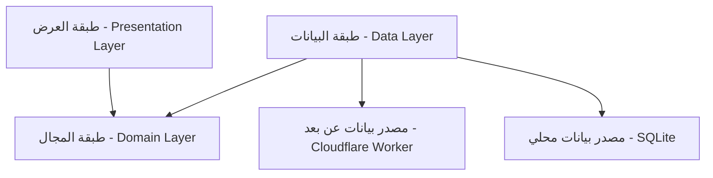

# أنماط النظام - MediSwitch (System Patterns)

## 🏗️ البنية المعمارية (Architecture)

يعتمد مشروع **MediSwitch** على مبادئ **Clean Architecture** لضمان فصل المسؤوليات، سهولة الصيانة، وقابلية الاختبار. يتم تقسيم التطبيق إلى ثلاث طبقات رئيسية:

### 1. طبقة العرض (Presentation Layer) - Flutter
هذه الطبقة مسؤولة عن كل ما يراه المستخدم ويتفاعل معه.
-   **الشاشات (Screens)**: صفحات التطبيق الكاملة.
-   **إدارة الحالة (State Management)**: نستخدم `Provider` لإدارة حالة التطبيق.
-   **المنطق (Logic)**: يتم فصل منطق العرض في فئات `Provider` (ViewModels).

### 2. طبقة المجال (Domain Layer) - Dart Pure
هذه هي الطبقة الجوهرية للتطبيق، وهي مستقلة تمامًا عن أي إطار عمل.
-   **الكيانات (Entities)**: تمثل كائنات البيانات الأساسية (مثل `DrugEntity`).
-   **حالات الاستخدام (Use Cases)**: تمثل العمليات (مثل `SearchDrugs`, `SyncData`).
-   **واجهات المستودعات (Repository Interfaces)**: عقود تحدد كيفية الوصول للبيانات.

### 3. طبقة البيانات (Data Layer) - Dart & Cloudflare
هذه الطبقة مسؤولة عن توفير البيانات للتطبيق.
-   **المستودعات (Repositories)**: تربط بين مصادر البيانات وطبقة المجال.
-   **مصادر البيانات (Data Sources)**:
    -   **محلي (Local)**: `SQLite` و `SharedPreferences` للعمل Offline-First.
    -   **سحابي (Cloud)**: `Cloudflare Worker API` للمزامنة والإعدادات.

## 🧩 أنماط التصميم (Design Patterns)

1.  **Repository Pattern**: فصل البيانات عن المنطق.
2.  **Add-on Architecture**: التعامل مع الإعلانات والميزات الإضافية كخدمات مستقلة (Services).
3.  **Singleton**: لإدارة الخدمات العامة (NetworkInfo, AdService).
4.  **Observer**: تحديث الواجهة تلقائياً عبر `ChangeNotifier`.
5.  **Multi-Table Bridge**: استخدام جدول `med_ingredients` لربط الأدوية بتفاعلاتها عبر المادة الفعالة (Many-to-Many).
6.  **Smart Classification Mapping**: استخدام `CategoryMapperHelper` لربط التصنيفات الفرعية بتصنيفات رئيسية موحدة لاقتراح بدائل ذكية.

## ⚙️ القرارات التقنية الرئيسية

### الواجهة الأمامية (Frontend - Flutter)
-   **State Management**: `Provider` للكفاءة والبساطة.
-   **Offline-First**: الاعتماد الأساسي على قاعدة البيانات المحلية، مع المزامنة الخلفية (Delta Sync/Background Fetch).
-   **Database**: `sqflite` لأداء عالي في البحث والفلترة المحلية.

### الواجهة الخلفية (Backend - Serverless)
-   **Architecture**: `Cloudflare Workers` بدلاً من الخوادم التقليدية لتقليل التكلفة وزيادة السرعة (Edge Computing).
-   **Database**: `Cloudflare D1` (Distributed SQLite) لتوافق ممتاز مع SQLite المحلي في التطبيق.
-   **Admin Dashboard**: `Cloudflare Pages` لاستضافة لوحة تحكم React خفيفة وسريعة.

## 🔄 تدفق البيانات (Data Flow)

مثال: **مزامنة التغييرات (Sync)**
1.  **Flutter App**: يرسل `last_update_timestamp` إلى `/api/sync/delta`.
2.  **Worker**: يستعلم D1 عن التغييرات التي حدثت بعد هذا التوقيع الزمني.
3.  **D1**: يعيد السجلات الجديدة/المعدلة فقط (Delta).
4.  **Worker**: يرسل البيانات مضغوطة (JSON).
5.  **Flutter App**: يستقبل البيانات، يحدث قاعدة البيانات المحلية SQLite، ويحفظ الطابع الزمني الجديد.

## 🛡️ الأمان (Security)
-   **API**: جميع الاتصالات مشفرة عبر HTTPS.
-   **Admin**: مصادقة قوية للمشرفين.
-   **Protection**: حماية الـ Token وإخفاء مفاتيح الـ Production.
