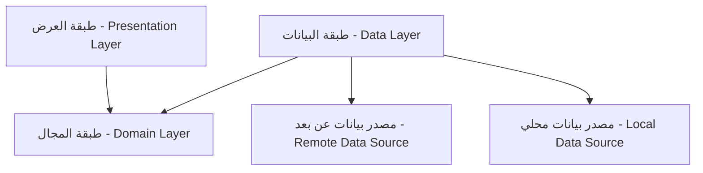

# أنماط النظام - MediSwitch (System Patterns)

## 🏗️ البنية المعمارية (Architecture)

يعتمد مشروع **MediSwitch** على مبادئ **Clean Architecture** لضمان فصل المسؤوليات، سهولة الصيانة، وقابلية الاختبار. يتم تقسيم التطبيق إلى ثلاث طبقات رئيسية:

### 1. طبقة العرض (Presentation Layer) - Flutter
هذه الطبقة مسؤولة عن كل ما يراه المستخدم ويتفاعل معه.
-   **الشاشات (Screens)**: صفحات التطبيق الكاملة (مثل الشاشة الرئيسية، شاشة التفاصيل).
-   **الأدوات (Widgets)**: مكونات واجهة المستخدم القابلة لإعادة الاستخدام (مثل بطاقة الدواء، شريط البحث).
-   **إدارة الحالة (State Management)**: نستخدم مكتبة `Provider` لإدارة حالة التطبيق بطريقة فعالة وبسيطة.
-   **المنطق (Logic)**: يتم فصل منطق العرض في فئات `Provider` (تعمل كـ ViewModels) التي تتواصل مع طبقة المجال.

### 2. طبقة المجال (Domain Layer) - Dart Pure
هذه هي الطبقة الجوهرية للتطبيق، وهي مستقلة تمامًا عن أي إطار عمل (Framework) أو مصدر بيانات.
-   **الكيانات (Entities)**: تمثل كائنات البيانات الأساسية في التطبيق (مثل `DrugEntity`, `DosageResult`).
-   **حالات الاستخدام (Use Cases)**: تمثل العمليات التي يمكن للمستخدم القيام بها (مثل `SearchDrugs`, `CalculateDose`). كل حالة استخدام تغلف منطق عمل واحد ومحدد.
-   **واجهات المستودعات (Repository Interfaces)**: عقود (Abstract Classes) تحدد كيفية الوصول للبيانات دون معرفة تفاصيل التنفيذ.

### 3. طبقة البيانات (Data Layer) - Dart
هذه الطبقة مسؤولة عن توفير البيانات للتطبيق، سواء من مصادر محلية أو خارجية.
-   **النماذج (Models)**: تمثيل البيانات القادمة من المصادر (JSON/DB) وتحويلها إلى كيانات.
-   **تنفيذ المستودعات (Repository Implementations)**: الفئات التي تطبق واجهات المستودعات وتربط بين مصادر البيانات وطبقة المجال.
-   **مصادر البيانات (Data Sources)**:
    -   **محلي (Local)**: قاعدة بيانات `SQLite` (باستخدام `sqflite`) لتخزين البيانات الدوائية، و `SharedPreferences` للإعدادات البسيطة.
    -   **عن بعد (Remote)**: اتصال `HTTP` مع الـ Backend API لجلب التحديثات والإعدادات.

## 🧩 أنماط التصميم المستخدمة (Design Patterns)

1.  **نمط المستودع (Repository Pattern)**: لفصل منطق الوصول للبيانات عن منطق الأعمال، مما يسمح بتغيير مصادر البيانات بسهولة دون التأثير على باقي التطبيق.
2.  **حقن التبعيات (Dependency Injection - DI)**: استخدام مكتبة `get_it` كـ Service Locator لتوفير وإدارة التبعيات عبر التطبيق، مما يسهل الاختبار ويقلل الارتباط (Coupling).
3.  **النمط الفردي (Singleton Pattern)**: يستخدم للمكونات التي يجب أن يكون لها نسخة واحدة فقط طوال دورة حياة التطبيق، مثل `DatabaseHelper` و `FileLoggerService`.
4.  **نمط المحول (Adapter Pattern)**: لتحويل البيانات من شكلها في قاعدة البيانات أو API (Models) إلى الشكل المستخدم في التطبيق (Entities).
5.  **نمط المراقب (Observer Pattern)**: يتم تطبيقه عبر `ChangeNotifier` في `Provider` لتحديث واجهة المستخدم تلقائيًا عند تغير البيانات.

## ⚙️ القرارات التقنية الرئيسية

### الواجهة الأمامية (Frontend - Flutter)
-   **إدارة الحالة**: تم اختيار `Provider` لسهولته وكفاءته ومناسبته لحجم المشروع مقارنة بـ BLoC المعقد.
-   **قاعدة البيانات المحلية**: تم اختيار `sqflite` لأنها توفر محرك SQL كامل وقوي، وهو ضروري لعمليات البحث المعقدة والربط بين الجداول (الأدوية، البدائل).
-   **التنقل (Navigation)**: استخدام نظام التنقل الأساسي في Flutter مع دعم التنقل المتداخل (Nested Navigation) للشريط السفلي.
-   **الشبكة (Networking)**: استخدام مكتبة `http` القياسية لخفتها وسهولتها للمهام المطلوبة.

### الواجهة الخلفية (Backend - Django)
-   **إطار العمل**: Django REST Framework (DRF) لبناء API قوي وآمن وسريع التطوير.
-   **قاعدة البيانات**: PostgreSQL لبيئة الإنتاج (Production) لمتانتها وأدائها العالي، و SQLite للتطوير المحلي.
-   **المصادقة**: استخدام JWT (JSON Web Tokens) لتأمين نقاط الاتصال الخاصة بالمشرفين.
-   **النشر (Deployment)**: استخدام Docker لتوحيد بيئة التشغيل، مع Nginx كخادم ويب عكسي (Reverse Proxy) و Gunicorn كخادم تطبيقات.

## 🔄 تدفق البيانات (Data Flow)

مثال: **عملية البحث عن دواء**
1.  **المستخدم**: يقوم بإدخال نص في شريط البحث.
2.  **Provider**: يستقبل المدخلات ويستدعي حالة الاستخدام `SearchDrugsUseCase`.
3.  **UseCase**: يطلب البيانات من `DrugRepository` (الواجهة).
4.  **Repository**: يقرر مصدر البيانات (في حالة البحث، يتوجه دائمًا للمصدر المحلي `LocalDataSource`).
5.  **DataSource**: ينفذ استعلام SQL (`SELECT * FROM drugs WHERE name LIKE ...`) على قاعدة بيانات SQLite.
6.  **Model**: يتم تحويل نتائج الاستعلام (Raw Data) إلى قائمة من كائنات `MedicineModel`.
7.  **Repository**: يقوم بتحويل `MedicineModel` إلى `DrugEntity` ويعيدها.
8.  **UseCase**: يعيد البيانات إلى الـ `Provider`.
9.  **Provider**: يحدث الحالة ويعلم الـ UI.
10. **UI**: تقوم الشاشة بإعادة البناء وعرض قائمة الأدوية.

## 🛡️ الأمان (Security)

-   **الاتصال (API)**: التخطيط لاستخدام HTTPS في بيئة الإنتاج لتشفير الاتصال بين التطبيق والخادم.
-   **البيانات المحلية**: البيانات مخزنة في SQLite بشكل عادي. تم التخلي عن التشفير المحلي (SQLCipher) في المرحلة الحالية (MVP) لتحسين الأداء وتقليل حجم التطبيق، نظرًا لأن البيانات الدوائية عامة وليست حساسة.
-   **التحقق من المدخلات**: يتم التحقق من صحة البيانات في كل من الواجهة الأمامية (قبل الإرسال) والواجهة الخلفية (قبل المعالجة) لمنع الهجمات والأخطاء.
