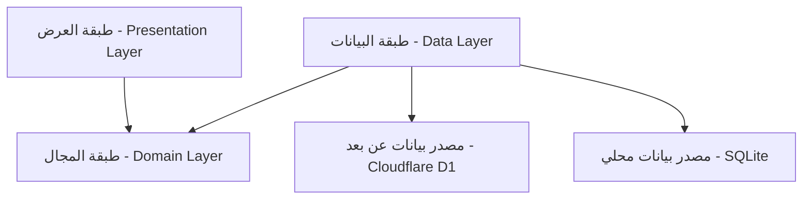

# أنماط النظام - MediSwitch (System Patterns)

## 🏗️ البنية المعمارية (Architecture)

يعتمد مشروع **MediSwitch** على مبادئ **Clean Architecture** لضمان فصل المسؤوليات، سهولة الصيانة، وقابلية الاختبار. يتم تقسيم التطبيق إلى ثلاث طبقات رئيسية:

### 1. طبقة العرض (Presentation Layer) - Flutter
هذه الطبقة مسؤولة عن كل ما يراه المستخدم ويتفاعل معه.
-   **الشاشات (Screens)**: واجهات التطبيق (UI).
-   **إدارة الحالة (State Management)**: نستخدم `Provider` لبساطته وكفاءته.
-   **المنطق (Logic)**: يتم فصل المنطق عن الرسم باستخدام ViewModels.

### 2. طبقة المجال (Domain Layer) - Dart Pure
الطبقة الجوهرية (النقية) المستقلة عن أي إطار عمل أو قاعدة بيانات.
-   **الكيانات (Entities)**: نماذج البيانات الأساسية (مثل `Drug`, `Interaction`).
-   **حالات الاستخدام (Use Cases)**: العمليات التجارية (مثل "البحث عن دواء", "مزامنة البيانات").
-   **العقود (Interfaces)**: تعريفات لكيفية عمل المستودعات (Repositories).

### 3. طبقة البيانات (Data Layer)
حلقة الوصل بين التطبيق ومصادر البيانات.
-   **المستودعات (Repositories)**: تنفيذ للعقود المحددة في طبقة المجال.
-   **المصادر (Data Sources)**:
    -   **محلي (Local)**: `SQLite` (للتخزين الدائم) و `SharedPreferences` (للإعدادات).
    -   **سحابي (Cloud)**: `Cloudflare Worker API` (لسحب البيانات الجديدة).

---

## 🧩 أنماط التصميم (Design Patterns)

1.  **Repository Pattern**:
    -   فصل منطق جلب البيانات عن واجهة المستخدم. يسمح بتغيير مصدر البيانات (مثلاً من API إلى Cache) دون التأثير على الشاشات.

2.  **Singleton Pattern**:
    -   يستخدم للخدمات التي يجب أن يكون لها نسخة واحدة فقط طوال حياة التطبيق، مثل `NetworkClient` و `DatabaseHelper`.

3.  **Adapter Pattern**:
    -   تحويل البيانات القادمة من API (JSON) إلى نماذج Dart (Models) والعكس.

4.  **Observer Pattern**:
    -   يستخدم `ChangeNotifier` لتحديث الواجهة تلقائياً عند تغير البيانات (مثلاً عند انتهاء التحميل أو حدوث خطأ).

5.  **Offline-First Strategy**:
    -   التطبيق يعتمد أولاً على البيانات المحلية. المزامنة تحدث في الخلفية، مما يضمن تجربة مستخدم سريعة جداً.

---

## ⚙️ القرارات التقنية الرئيسية

### الواجهة الأمامية (Flutter)
-   **إدارة الحالة**: تم اختيار `Provider` لأنه الخيار الرسمي الموصى به من Google للمشاريع متوسطة الحجم، ولأنه يقلل من التعقيد (Boilerplate).
-   **قاعدة البيانات**: `sqflite` هو الخيار الأفضل للأداء العالي مع كميات بيانات كبيرة (23,000+ دواء) مقارنة بـ Hive أو SharedPreferences.

### الواجهة الخلفية (Serverless)
-   **Cloudflare Workers**: تم استبدال الخوادم التقليدية (VPS/Django) بـ Workers لتقليل التكلفة إلى الصفر تقريباً وزيادة سرعة الاستجابة عالمياً.
-   **Cloudflare D1**: قاعدة بيانات SQL موزعة، تتوافق تماماً مع SQLite المستخدم في التطبيق، مما يسهل المزامنة.

## 🔄 تدفق البيانات (Data Sync Flow)

1.  **طلب التحديث**: التطبيق يطلب `/api/sync` ويرسل تاريخ آخر تحديث لديه.
2.  **حساب الفروقات**: الـ Worker يستعلم قاعدة D1 عن السجلات التي تم تعديلها بعد هذا التاريخ.
3.  **الاستجابة**: الـ Worker يعيد فقط البيانات الجديدة (JSON).
4.  **التخزين**: التطبيق يحفظ البيانات الجديدة في SQLite ويحدث تاريخ "آخر مزامنة".
