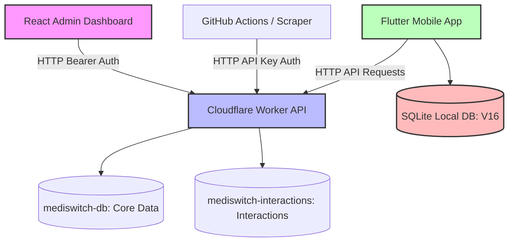

# أنماط وهندسة النظام - MediSwitch (System Patterns)

## 📄 المراجع الأساسية
*   [projectbrief.md](file:///f:/App-Projects/mediswitch/memory-bank/projectbrief.md) - هندسة المشروع الكبرى.
*   [database_architecture.md](file:///f:/App-Projects/mediswitch/memory-bank/database_architecture.md) - هيكلية الجداول محلياً وسحابياً.

---

## 🏗️ الهيكل التنظيمي للمشروع وعلاقات المكونات (Component Architecture)

يتكون مشروع MediSwitch من ثلاثة تطبيقات فرعية تتفاعل معاً لتأمين مسار البيانات بالكامل:

```mermaid
graph TD
    Dashboard[React Admin Dashboard] -- HTTP Bearer Auth --> Worker[Cloudflare Worker API]
    Actions[GitHub Actions / Scraper] -- HTTP API Key Auth --> Worker
    Worker --> D1_Core[(mediswitch-db: Core Data)]
    Worker --> D1_Interactions[(mediswitch-interactions: Interactions)]
    
    App[Flutter Mobile App] -- HTTP API Requests --> Worker
    App --> SQLite[(SQLite Local DB: V16)]
    
    style Dashboard fill:#f9f,stroke:#333,stroke-width:2px
    style Worker fill:#bbf,stroke:#333,stroke-width:2px
    style App fill:#bfb,stroke:#333,stroke-width:2px
    style SQLite fill:#fbb,stroke:#333,stroke-width:2px
```

### 1. تطبيق الجوال (Flutter App) - هيكلية Clean Architecture
يتم تطبيق فصل صارم للمسؤوليات داخل مجلد `lib` بالشكل التالي:
*   **`core`**: يحتوي على الثوابت (`constants`)، وإعدادات الاتصال وحقن التبعيات (`di/locator.dart`)، وإدارة قاعدة البيانات المباشرة (`database/database_helper.dart`)، والخدمات المشتركة مثل المزامنة الموحدة (`services/unified_sync_service.dart`).
*   **`data`**:
    *   `datasources`: مصادر البيانات المحلية (SQLite عبر `sqlite_local_data_source.dart`) والبعيدة (أقراص HTTP عبر Remote Data Sources).
    *   `models`: كائنات تحويل البيانات (JSON/Row Map -> Dart Object).
    *   `repositories`: تطبيق مستودعات البيانات التي تحدد استراتيجيات جلب البيانات (مثال: Cache-First).
*   **`domain`**:
    *   `entities`: كائنات الأعمال الصافية والمنظفة (Clean Dart) مثل `DrugEntity` و `DrugInteraction`.
    *   `usecases`: العمليات الوظيفية الصرفة (أمثلة: `SearchDrugsUseCase` و `FindDrugAlternativesUseCase`).
*   **`presentation`**:
    *   `bloc` (ChangeNotifier Providers): إدارة الحالة وإيصال البيانات للشاشات (مثال: `MedicineProvider`, `SubscriptionProvider`).
    *   `screens` & `widgets`: واجهات المستخدم والعناصر الرسومية.

### 2. النظام الخلفي (Cloudflare Workers API) - `worker.js`
*   يعمل كبوابة API لا مركزية (Serverless API).
*   **توجيه قواعد البيانات (DB Routing)**:
    *   يتصل بـ `DB` (قاعدة `mediswitsh-db` الأساسية) لقراءة وتحديث الأدوية والنسخ والإعدادات.
    *   يتصل بـ `INTERACTIONS_DB` (قاعدة `mediswitch-interactions`) لقراءة وإدارة التفاعلات الطبية ومكوناتها لتفادي حدود الحجم.
*   **التحقق والمصادقة**:
    *   يتحقق من مفتاح تحديث البيانات في ترويسة `Authorization` لتحديثات GitHub Actions.
    *   *ملاحظة فنية*: لا تزال منافذ الأدمن العادية تفتقر للتحقق من المفتاح في الخادم، ويتم حمايتها برمجياً في الواجهة الأمامية للوحة التحكم عبر مقارنة المفتاح المدخل بمفاتيح البيئة السحابية.

### 3. لوحة التحكم (React Admin Dashboard)
*   مبنية باستخدام React و TypeScript مع Vite و Tailwind CSS (مع سمات فضاء احترافية Space Command).
*   **API Client (`src/lib/api.ts`)**: يقوم بتغليف طلبات HTTP وإضافة مفتاح الأدمن كرمز Bearer Token في ترويسة `Authorization` لتمريره إلى الـ API الخلفي.
*   **إدارة الميزات وبوابات الترخيص**: واجهة لتعديل صلاحيات باقات الاشتراك (Permissions) وحفظها بتنسيق JSON لتحديد ميزات المستخدمين.

---

## 🔄 الأنماط البرمجية المطبقة (Design Patterns)

### 1. نمط المستودع الهجين الذكي (Hybrid Cache-First Repository Pattern)
يتم تطبيق هذا النمط للتحكم بملفات التفاعلات والجرعات الضخمة لحماية حجم التطبيق وأداء الذاكرة:
*   عند استدعاء `findAllInteractionsForDrug(drug)` in `InteractionRepositoryImpl`:
    1.  يتم البحث محلياً في SQLite عن تفاعلات المادة الفعالة للدواء.
    2.  إذا كانت النتيجة فارغة، يتم الاتصال بالـ API الخلفي لجلب التفاعلات من قاعدة `mediswitch-interactions`.
    3.  عند الحصول عليها، يتم تخزينها محلياً في SQLite عبر `SqliteLocalDataSource.saveDrugInteractions` وتمريرها للشاشة.
    4.  في المرة القادمة، يقرأها التطبيق محلياً وبشكل فوري تماماً دون إنترنت.

### 2. نمط الخدمة الفردية (Singleton Pattern)
*   جميع الخدمات الثقيلة مثل `DatabaseHelper` و `FileLoggerService` مسجلة كـ `Singleton` أو `LazySingleton` في محدد الخدمات `GetIt` لضمان استهلاك ذاكرة منخفض وعدم تكرار فتح الاتصال مع SQLite.

### 3. نمط المراقبة وإدارة الحالة (Observer Pattern with Providers)
*   تحديث شاشات التطبيق يتم تلقائياً بالاعتماد على `ChangeNotifierProvider` و `context.watch<T>()` لضمان فصل منطق البيانات عن الرسوم وتحديث الواجهة لحظياً عند اكتمال مزامنة البيانات أو الإعلانات.
